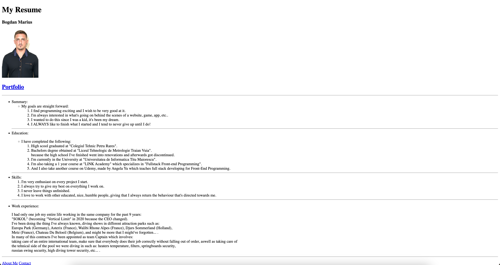

# The First Step - My Initial Resume


[](#)


> A simple digital resume project, marking the beginning of my journey into web development.

## Overview
This is my very first project, a digital resume built using HTML and CSS. It serves as a structured way to showcase my background, education, skills, and experience in a clean and readable format. The project follows a straightforward layout with sections covering personal details, portfolio, and contact information.

## Preview

<p align="center">
  
</p>

## Features
- **Personal Information Section:** Displays name, portrait, and career goals. 
- **Education & Skills Overview:** Lists educational background and technical/non-technical skills. 
- **Work Experience Details:** Highlights professional background and responsibilities. 
- **Minimalist Design:** Clean and simple layout with an easy-to-read format. 
- **Fully Responsive:** Optimized for both desktop and mobile viewing.


## Live Demo
**Explore the live version here:** [View Live Demo](https://marius-bogdan.com/projects/first-project/)

## Local Setup
1. **Clone** the repository:
   ```bash
   git clone https://github.com/MIBogdan/first-project.git
   ```
2. **Open** the `index.html` file in your browser
   *- or use a local development server (like VS Code Live Server) for a smoother development experience.*


---

## Author
**Marius Bogdan**  
[Personal portfolio](https://marius-bogdan.com/)

Feel free to reach out for any questions or collaborations!

## License

This project is provided for testing and demonstration purposes only. All rights are reserved. No part of this project may be redistributed, reuploaded, or used in any manner (commercially or otherwise) without explicit written permission from the author.

